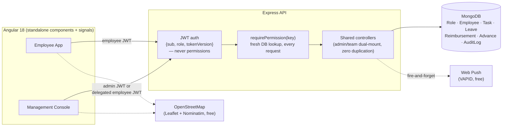

# SUNदेश

A workforce management system for a solar installation company: attendance, task assignment with site GPS, leave/reimbursement/advance approvals, payroll, and delegated admin access — built and running in production.

**[Live app →](https://avyanta.vercel.app/)**

Full-stack: Angular 18 (standalone components, signals) + Node/Express + MongoDB.

[Owner's task list — status, site map, notes, Google Maps link]


Two apps, one codebase. The owner (and anyone they delegate to) gets a management console; the workforce gets a simple mobile app.

<table>
<tr>
<td width="50%">

**Owner console** — assign a task, pin the site on a map (typing an address geocodes it automatically):

[Assign Task form with a geocoded map pin]


</td>
<td width="50%">

**Employee app** — the same task, on a phone, with directions and a status button:

[Employee mobile task view](docs/screenshots/employee-work-mobile.png)


</td>
</tr>
</table>

<details>
<summary>More screenshots (Employees list, Roles &amp; Permissions)</summary>
<br>

[Employees list](docs/screenshots/owner-employees.png)


[Roles and Permissions](docs/screenshots/owner-roles.png)

</details>

---

## The interesting part: delegation

The owner can hand off pieces of the console to a Supervisor or Manager — approve leave, assign tasks, manage employees — permission by permission, without giving up control of payroll or personal data. A few things that took real work to get right:

- **One codebase, two identities.** Every delegable feature is mounted at both `/api/admin/*` and `/api/team/*`, hitting the exact same controller. A single Angular injection token decides which prefix a service calls. There's no separate "supervisor UI" to keep in sync — it's the same components, gated by what the logged-in identity is actually allowed to do.
- **Permissions are checked live, every request**, against the database — not baked into the JWT. Revoke someone's access and it's gone on their next click, not their next login.
- **A delegated Manager can't approve their own request**, or edit their own salary, through the very console they've been given access to. Both are enforced server-side, checked directly against the request's identity.
- **Salary and Aadhaar/UPI are withheld from anyone but the true owner**, even someone with full "Employees" permission — the field just isn't in the API response.
- Every mutating action, by the owner or a delegate, lands in an audit log with who did what to which record.

---

## Everything else it does

**Owner console:** employee lifecycle (create/edit/deactivate, credential reset), a role/permission builder for custom delegation, a per-employee profile page (attendance + leave/reimbursement/advance/task history in one place, each tab gated by the viewer's actual permission), task assignment with map-based site location and a Pending → In Progress → Completed status lifecycle, an approvals dashboard for leave/reimbursement/advance/attendance-regularization, payroll calculated from attendance and approved leave with UPI pay-out, and search/filter on every list.

**Employee app:** attendance punch in/out, push notifications the moment a task is assigned (works with the app closed), a task view with the site on a map and one-tap directions, a note thread per task so a laborer can flag an issue without a phone call, and leave/reimbursement/advance requests from the same interface. Below 640px, tab rows become a native `<select>` instead of an unusable horizontal scroll.

---

## Architecture



Maps, geocoding, and push notifications all run on free infrastructure (Leaflet/OpenStreetMap, Web Push/VAPID) instead of metered APIs — this is a small internal tool for a labor workforce, not a product with a maps budget, so that constraint was worth designing around rather than working past.

---

## Bugs I found and fixed (with evidence)

**Stale permission defaults after adding a new permission key.** Partway through development I added a 7th permission (`approvalsAdvance`) to the catalog. Mongoose's schema default (`true`) silently backfilled it onto every role that had already been seeded — including the base "Employee" role, which is supposed to be all-`false`. Every plain employee could suddenly reach a management-console entry point they had no business seeing. Found it by querying the affected employee's role directly in the database, not by guessing. Fixed at the seed script, which now re-syncs missing keys on existing roles instead of only creating new ones, and at the query layer, since a status filter built the same way would have hit the same bug again — it now matches `{status: X}` or `{status: {$exists: false}}` so old data can't silently regress it a second time.

**A conflict-of-interest gap in a feature I'd already "finished."** I'd built self-approval prevention for leave/reimbursement/advance requests, then had it pointed out that a Supervisor or Manager is themselves an Employee record — and could still edit their own salary and personal details through the Employees feature, because that specific guard had never been extended there. Same fix pattern as before: a delegated session can't mutate the Employee document matching its own identity.

**A timezone bug that only shows up at 2 AM.** The employee app computed "today" with `new Date().toISOString()` — UTC, which sits a full calendar day behind IST for the first 5.5 hours after midnight. A task genuinely dated "today" would look like it was in the future to the client during that window, silently hiding the "Start Work" button. I confirmed it with the exact UTC timestamp that reproduces the gap, then fixed it with a shared IST-aware date utility that mirrors the backend's own calculation instead of trusting the browser's local clock math.

**An Angular input that let typed letters visibly stick.** A phone field stripped non-digits on keystroke, but letters still showed up on screen. The cause: Angular's `[value]` binding only re-renders the DOM when the *bound signal* changes — typing a letter into an empty field still computed to `''`, so Angular saw no change and never told the browser to overwrite what it had already painted. Fixed by writing the sanitized value directly onto the DOM element inside the handler. I didn't take this on faith either — I scripted a real headless-Chromium run that typed into the field and asserted on the rendered value before calling it fixed.

**A pass at latency, not just features.** Read-only Mongoose queries got `.lean()` (skips full document hydration); a status filter and an employee-history filter each got a compound index where neither previously had one to use; push notifications were made fire-and-forget so a third-party network call can't add latency to the owner's request; a map component only starts fetching tiles once its row actually scrolls into view instead of loading every pinned location on the page at once.

---

## Tech Stack

| | |
|---|---|
| Frontend | Angular 18 (standalone components, signals), TypeScript |
| Backend | Node.js, Express, JWT auth |
| Database | MongoDB + Mongoose |
| Maps & Geocoding | Leaflet + OpenStreetMap + Nominatim (free, no API key) |
| Push Notifications | Web Push API, VAPID (free, no Firebase) |
| Deployment | Render (API) + Vercel (client) |

---

## Getting Started

```bash
# Backend
cd server
npm install
npm run seed:roles          # one-time: seeds Employee/Supervisor/Manager roles
npm run dev                  # nodemon, http://localhost:5000

# Frontend
cd client
npm install
npm start                    # http://localhost:4200
```

Environment variables (`server/.env`): `MONGODB_URI`, `JWT_SECRET`, `VAPID_PUBLIC_KEY` / `VAPID_PRIVATE_KEY` / `VAPID_SUBJECT` (generate with `node -e "console.log(require('web-push').generateVAPIDKeys())"`).

---

## Project Structure

```
server/
  src/
    controllers/    # one per resource; admin + delegated share the same file
    middleware/      requirePermission.js — the permission-check middleware
    models/          Role, Employee, Task, Leave, Reimbursement, ...
    routes/          dual-mounts /admin/* and /team/* to the same controller
    utils/           audit.js, reviewGuard.js (self-approval), pushNotify.js
client/
  src/app/
    core/            services, guards, the API_SCOPE token
    features/        one folder per screen (employee-facing + superadmin/*)
    shared/          shell components, the Leaflet location-picker, icons
```

---

## Roadmap

Updated as features ship:

- [ ] Team-scoped visibility ("my crew only") for delegated roles, instead of the whole company
- [ ] A read-only permission tier
- [ ] Photo proof-of-work on task completion
- [ ] Cross-check a task's site GPS against the employee's attendance punch location

---

## Author

**Abhinav Verma**
